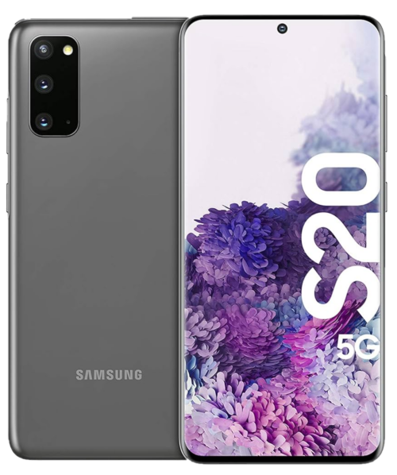

# Lineage Release Hub

Repo to upload all my lineage builds lol

## Devices



### Galaxy S20 5G (x1s)

- [Releases](https://github.com/halal-beef/lineage_release_hub/releases/)

#### Flashing instructions

##### Windows

- Download the ROM and ```recovery.tar``` file

- Install the Samsung USB Drivers, install the Google platform tools and download odin if not done already

- Connect your phone in download mode to your PC and open odin

- Add the recovery.tar to the AP slot and flash

- When the phone reboots hold the power and volume up button to enter recovery

- Press install and install via ADB

- On the PC sideload the zip via running ```adb sideload <path/to/lineage.zip>```

- After installation, you can also sideload gapps at this point if you want to

- Wipe data and factory reset IF coming from another rom

- Reboot the phone into LineageOS

#### Linux

- Download the ROM and ```recovery.img``` file

- Install the android-tools package and heimdall if not done already

- Connect your phone in download mode to your PC

- Run ```heimdall flash --RECOVERY <path/to/recovery.img>```

- When the phone reboots hold the power and volume up button to enter recovery

- Press install and install via ADB

- On the PC sideload the zip via running ```adb sideload <path/to/lineage.zip>```

- After installation, you can also sideload gapps at this point if you want to

- Wipe data and factory reset IF coming from another rom

- Reboot the phone into LineageOS

#### Flashing quirks

If you flash the ROM and the phone immediately reboots when starting the installation, reboot into recovery and wipe system, then reflash the rom.

The reboot seems to be caused by an addon.d script by created GAPPS packages
